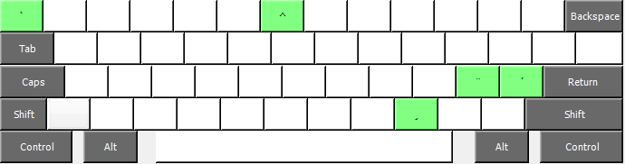

# Better-Qwerty
A Qwerty with accentuated letters as dead keys.  
Open the .klc file with Microsoft Keyboard Layout Creator or just download the install package in the releases.

If you want to build the keyboard yourself and KLC can't open it, check your .klc file has line breaks set to CRLF.
